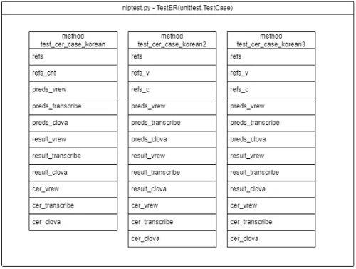
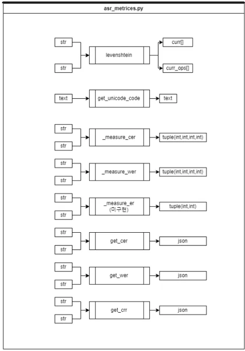
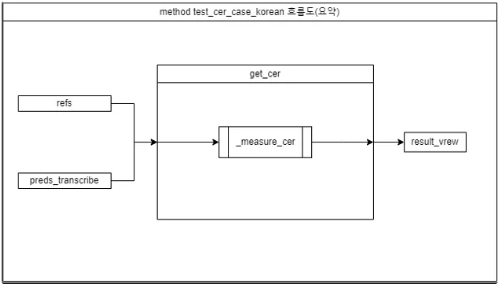
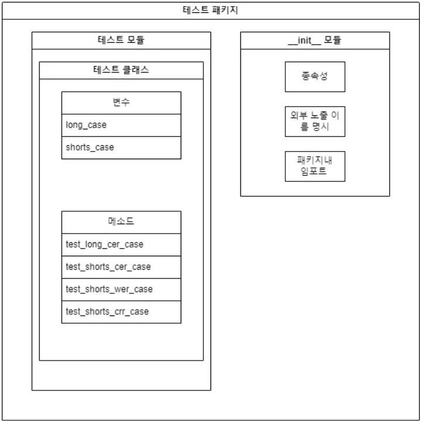
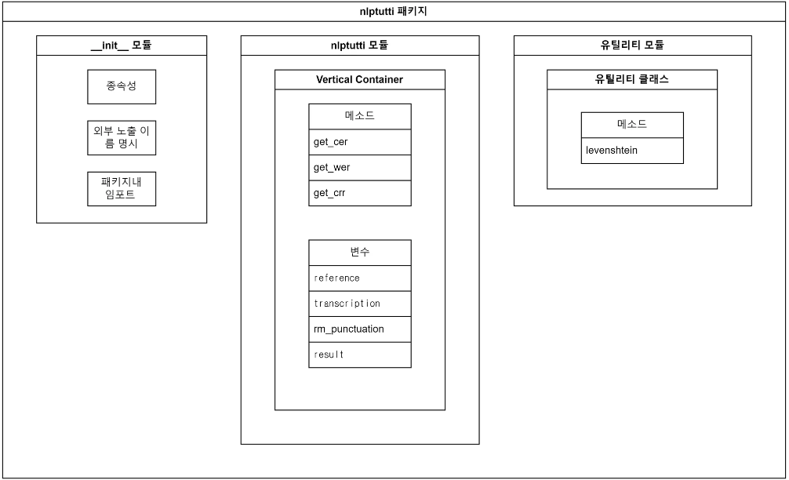
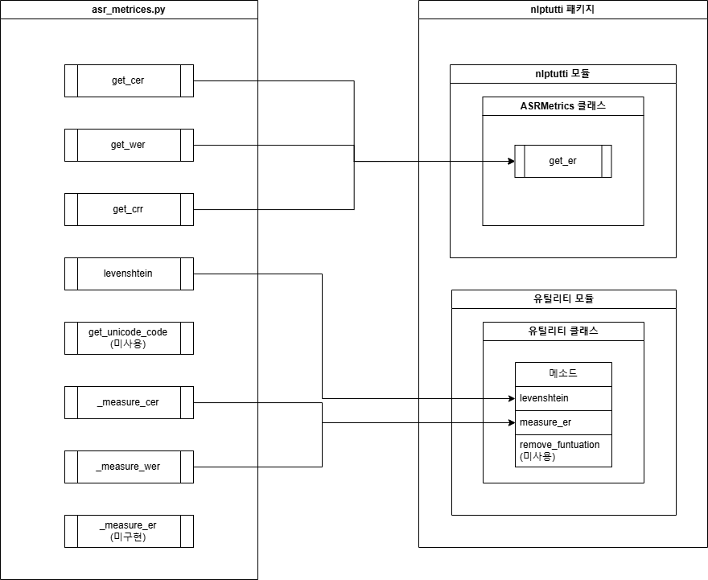
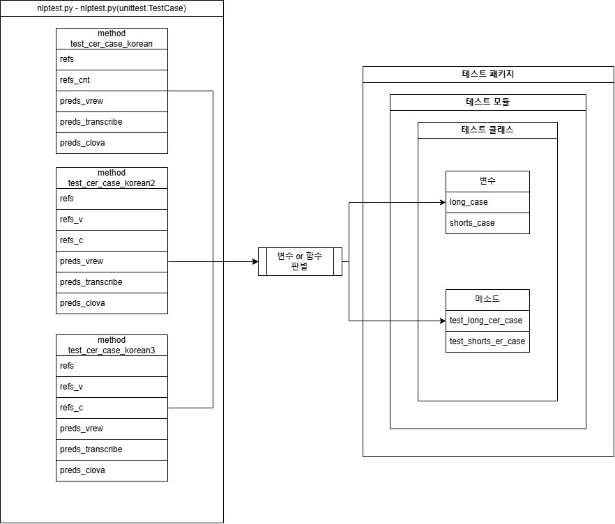
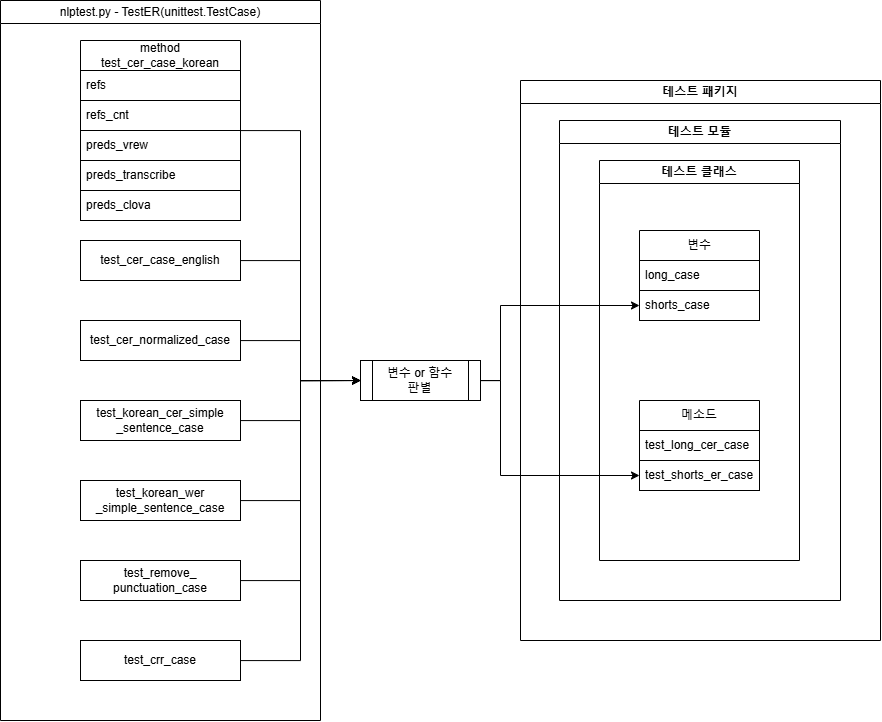

# 코드 리펙토링 프로젝트

# 목차
1. 프로젝트 개요  
2. 코드 리펙토링 방향성  
3. 코드 분석  
    1. 프로젝트 구성 파일  
    2. 프로그램 동작 패키지  
    3. 테스트 코드 패키지  
    4. 프로그램 동작과정  
4. 코드 리펙토링  
    1. 클래스 다이어그램 작성 - 완  
    2. 패키지 제작 - 완  
    3. 도커 제작 - 완  
    4. 프로젝트 구성 파일 내용 작성 - 완  
5. 코드 리펙토링 결과  
    1. 패키지 - 완  
    2. 프로젝트 구성 파일 - 완  
    3. 도커 이미지 - 완  
    4. 기존과 클래스 다이어그램 비교
6. 후기
7. 적용된 기술

# 1. 프로젝트 개요
## 1.1 원본 정보

원본 제목 : Korean STT error rates  
원본 저장소 : https://github.com/hyeonsangjeon/computing-Korean-STT-error-rates

## 1.2 프로젝트 목적

- 다른사람의 프로젝트를 코드 리팩토링 진행하며 남의 코드를 이해하고 수정 및 사용하는 능력을 기르고자함

# 2. 코드 리펙토링 방향성

- 모듈 및 패키지화
- 함수 지향형 코드 → 클래스 지향형 코드
- 폴더 정리
- 배포 : 도커 파일

# 3. 코드 분석

## 3.1 프로젝트 구성 파일

### 3.1.1 setup.py
    - setuptools를 활용한 프로젝트의 기본 정보 기록
    - 배포를 가능하게 만든 파일
### 3.1.2 requirements.txt
    - 프로젝트에서 사용한 외부 라이브러리들의 이름을 모아놓은 파일
### 3.1.3 README.md
    - 프로젝트의 상세 설명이 담긴 파일
### 3.1.4 LICENSE
    - 프로젝트의 라이센스가 담긴 파일(MIT LICENSE 사용중)
### 3.1.5 gitinore
    - git에 프로젝트를 저장할시 미포함 시킬 파일 및 폴더를 작성한 파일
### 3.1.6 pic
    - README.md에서 사용한 사진을 저장해놓은 폴더

## 3.2 프로그램 패키지

### 3.2.1 __init__.py 
    - 모듈의 문서 형식 지정
        
        ```
        __docformat__ = "restructuredtext":
        ```
        
    - 의존성 (필수 의존성 패키지)
        
        ```python
        hard_dependencies = ("jiwer", "pandas")
        ```
        
    - 사용 모듈 임포트
        
        ```python
        from nlptutti.asr_metrics import (
            get_cer,
            get_wer,
            get_crr,
        )
        ```
        
    - 프로젝트 내에서 사용할 때 노출될 이름들을 명시 하지 않음(제작했던 흔적은 있음)
        
        ```python
        #__all__ = ["get_cer",
        #           "get_wer"]
        ```
        
### 3.2.2 asr_metrics.py
    1. def levenshtein(u, v):
        
        ```
        내용 : 두 문자열 간의 Levenshtein 거리(편집 거리)를 계산하며, 대체, 삭제, 삽입 연산의 개수를 반환.
        
        입력:
        u : 참조 문자열 (reference string)
        v : 변환된 문자열 (transcription string)
        
        출력:
        curr[len(v)] : 두 문자열 간의 편집 거리
        curr_ops[len(v)] : (대체 횟수, 삭제 횟수, 삽입 횟수) 형태의 튜플
        ```
        
    2. def get_unicode_code(text):
        
        ```
        내용 : 입력된 문자열에서 유니코드 문자를 '\uXXXX' 형식으로 변환한 문자열을 반환.
        
        입력
        text : 변환할 문자열 (string)
        
        출력:
        result : 변환된 문자열, ASCII 문자는 그대로 두고 유니코드 문자는 '\uXXXX' 형식으로 변환됨
        ```
        
    3. def _measure_cer(reference: str, transcription: str) -> Tuple[int, int, int, int]:
        
        ```
        내용 : 두 문자열 간의 문자 오류율(CER)을 계산하기 위해 대체, 삭제, 삽입, 그리고 정답 문자의 개수를 반환.
        
        입력:
        reference : 참조 문자열 (reference string)
        transcription : 변환된 문자열 (transcription string)
        
        출력:
        hits : 정답 문자 수
        substitutions : 대체 횟수
        deletions : 삭제 횟수
        insertions : 삽입 횟수
        ```
        
    4. def _measure_wer(reference: str, transcription: str) -> Tuple[int, int, int, int]:
        
        ```
        내용 : 두 문자열 간의 단어 오류율(WER)을 계산하기 위해 대체, 삭제, 삽입, 그리고 정답 단어의 개수를 반환.
        
        입력:
        reference : 참조 문자열 (reference string)
        transcription : 변환된 문자열 (transcription string)
        
        출력:
        hits : 정답 단어 수
        substitutions : 대체 횟수
        deletions : 삭제 횟수
        insertions : 삽입 횟수
        ```
        
    5. def _measure_er(reference: str, transcription: str) -> Tuple[int, int]:
        
        ```
        내용 : 문장이 완벽하게 번역되었는지 판단하는 함수 (구현 필요).
        
        입력:
        reference : 참조 문자열 (reference string)
        transcription : 변환된 문자열 (transcription string)
        
        출력:
        TBD1 : 미정 (To be determined)
        TBD2 : 미정 (To be determined)
        ```
        
    6. def get_cer(reference, transcription, rm_punctuation=True) -> json:
        
        ```
        내용 : 두 문자열 간의 문자 오류율(CER)을 계산하여 결과를 반환. 
        구두점 제거 여부를 선택할 수 있음.
        
        입력:
        reference : 참조 문자열 (reference string)
        transcription : 변환된 문자열 (transcription string)
        rm_punctuation : 구두점 제거 여부 (True면 구두점 제거, False면 제거하지 않음)
        
        출력:
        result : JSON
        {'cer': cer, 'substitutions': 대체 횟수, 'deletions': 삭제 횟수, 'insertions': 삽입 횟수}  
            
        ```
        
    7. def get_wer(reference, transcription, rm_punctuation=True) -> json:
        
        ```
        내용 : 두 문자열 간의 단어 오류율(WER)을 계산하여 결과를 반환. 
        구두점 제거 여부를 선택할 수 있음.
        
        입력:
        reference : 참조 문자열 (reference string)
        transcription : 변환된 문자열 (transcription string)
        rm_punctuation : 구두점 제거 여부 (True면 구두점 제거, False면 제거하지 않음)
        
        출력:
        result : JSON 
        {'wer': wer, 'substitutions': 대체 횟수, 'deletions': 삭제 횟수, 'insertions': 삽입 횟수} 
        ```
        
    8. def get_crr(reference, transcription, rm_punctuation=True) -> json:
        
        ```
         내용 : 두 문자열 간의 문자 오류율(CER)을 기반으로 문자 인식률(CRR)을 계산하여 결과를 반환. 
         구두점 제거 여부를 선택할 수 있음.
        
         입력:
         reference : 참조 문자열 (reference string)
         transcription : 변환된 문자열 (transcription string)
         rm_punctuation : 구두점 제거 여부 (True면 구두점 제거, False면 제거하지 않음)
        
         출력:
         result : JSON
         {'crr': crr, 'substitutions': 대체 횟수, 'deletions': 삭제 횟수, 'insertions': 삽입 횟수}
          
        ```
        

## 3.3 테스트 코드 패키지

### 3.3.1 nlptest.py
    1. TestER class
        
         def test_cer_case_korean(self):
        
         def test_cer_case_korean2(self):
        
         def test_cer_case_korean3(self):
        
        ```
        내용 : 세 가지 음성 인식 모델의 예측 텍스트와 참조 텍스트를 비교하여 문자 오류율(CER)을 계산하고 출력.
        단 입력값 및 출력값이 실제로 들어오고 나가지 않는다.
        입력값 : 변수에서 string을 직접 입력 
        출력값 : print 함수 사용
        
        입력:
        refs : 참조 텍스트 (원본 텍스트)
        refs_cnt : 참조 텍스트(단축형)
        preds_vrew : VREW 음성 인식 모델의 예측 텍스트
        preds_transcribe : Transcribe 음성 인식 모델의 예측 텍스트
        preds_clova : Clova 음성 인식 모델의 예측 텍스트
        
        출력:
        cer_vrew : VREW 모델에 대한 문자 오류율(CER)
        cer_transcribe : Transcribe 모델에 대한 문자 오류율(CER)
        cer_clova : Clova 모델에 대한 문자 오류율(CER)
        ```
        
### 3.3.2 test_er.py
    1. 모든 메소드 중복 내용
        
        ```
        입력값 및 출력값이 실제로 들어오고 나가지 않는다.
        입력값 : 변수에서 string을 직접 입력 
        출력값 : print 함수 사용
        ```
        
    2. def test_cer_case_korean(self):
        
        ```
        내용: 한글 예제 텍스트에 대해 CER(문자 오류율)을 계산하고 기대값과 비교하여 정확성을 확인.
        입력:
        refs: 참조 텍스트 ("아키택트")
        preds: 예측된 텍스트 ("아키택쳐")
        출력:
        char_error_rate: 계산된 문자 오류율(CER)
        expected_error_rate: 기대하는 CER 값 (0.25)
        ```
        
    3. def test_cer_case_english(self):
        
        ```
        내용: 영어 예제 텍스트에 대해 CER(문자 오류율)과 삭제된 문자의 수를 확인하고 기대값과 비교하여 정확성을 확인.
        입력:
        refs: 참조 텍스트 ("My hoverscraftis full of eels")
        preds: 예측된 텍스트 ("My hovercraft is full of eels")
        출력:
        cer: 계산된 문자 오류율(CER)
        deletions: 삭제된 문자 수
        expected_error_rate: 기대하는 CER 값 (0.04)
        expected_deletion: 기대하는 삭제된 문자 수 (1)
        ```
        
    4. def test_cer_normalized_case(self):
        
        ```
        내용: CER이 정상적으로 계산되는지 확인하기 위해 문자 삽입이 있는 예제를 테스트.
        입력:
        refs: 참조 텍스트 ("STEAM")
        preds: 예측된 텍스트 ("STREAM")
        출력:
        cer: 계산된 문자 오류율(CER)
        expected_error_rate: 기대하는 CER 값 (0.1666666666)
        ```
        
    5. def test_korean_cer_simple_sentence_case(self):
        
        ```
        내용: 한글의 간단한 문장 예제를 사용하여 CER을 계산하고 기대값과 비교.
        입력:
        refs: 참조 텍스트 ("제이 차 세계 대전은 인류 역사상 가장 많은 인명 피해와 재산 피해를 남긴 전쟁이었다")
        preds: 예측된 텍스트 ("제이차 세계대전은 인류 역사상 가장많은 인명피해와 재산피해를 남긴 전쟁이었다")
        출력:
        cer: 계산된 문자 오류율(CER)
        expected_error_rate: 기대하는 CER 값 (0.0)
        ```
        
    6. def test_korean_wer_simple_sentence_case(self):
        
        ```
        내용: 한글의 간단한 문장 예제를 사용하여 WER(단어 오류율)을 계산하고 기대값과 비교.
        입력:
        refs: 참조 텍스트 ("대한민국은 주권 국가 입니다.")
        preds: 예측된 텍스트 ("대한민국은 주권국가 입니다.")
        출력:
        wer: 계산된 단어 오류율(WER)
        expected_error_rate: 기대하는 WER 값 (0.5)
        ```
        
    7. def test_remove_punctuation_case(self):
        
        ```
        내용: 구두점을 제거한 경우 WER(단어 오류율)을 계산하고 기대값과 비교.
        입력:
        refs: 참조 텍스트 ("또 다른 방법으로, 데이터를 읽는 작업과 쓰는 작업을 분리합니다!")
        preds: 예측된 텍스트 ("또! 다른 방법으로 데이터를 읽는 작업과 쓰는 작업을 분리합니다.")
        출력:
        wer: 계산된 단어 오류율(WER)
        expected_error_rate: 기대하는 WER 값 (0.0)
        ```
        
    8. def test_crr_case(self):
        
        ```
        내용: CRR(문자 인식률)을 계산하고 기대값과 비교.
        입력:
        refs: 참조 텍스트 ("또 다른 방법으로, 데이터를 읽는 작업과 쓰는 작업을 분리합니다!")
        preds: 예측된 텍스트 ("또! 다른 방법으 데이터를 읽는 작업과 쓰는 작업을 분리합니다.")
        출력:
        crr: 계산된 문자 인식률(CRR)
        expected_error_rate: 기대하는 CRR 값 (0.96)
        ```
        

## 3.4 프로그램 동작 과정


- nlptest,TestER의 string데이터
(refs류,preds_류)에서 get_cer,_measure_cer을 거쳐서 필요한 데이터를 print하는게 주요 흐름이다


- 모든 함수의 흐름이 method test_cer_case_korean와 비슷하여 이 부분의 흐름만 요약함

# 4. 코드 리펙토링

## 4.1 클래스 다이어그램 작성

### 4.1.1 중점 내용
1. Test 모듈 정비
    - 두 테스트모듈 nlptest,test_er이 같은형식을 띄고있어 하나의 모듈로 합침
    - nlptest의 메소드들은 입력 문자열만 다르고 과정이 같음
    하나의 메소드로 통일후 입력 문자열 리스트만 따로 만듬
2. 미사용 코드, 제작 중단된 코드 제거
3. 클래스별 코드 분리
    - 유틸클래스, 알고리즘클래스,테스트 패키지 분리
- 테스트 패키지 다이어그램
    
    
    

- nlptutti 패키지
    
    

# 5. 코드리팩토링 결과
## 5.4 기존과 클래스 다이어그램 비교  
### 5.4.1 원본(nlptutti패키지) vs 리펙토링본(nlptutti패키지)  
      
### 5.4.2 원본(test패키지 nlptest모듈) vs 리펙토링본(test_pack패키지)  
      
### 5.4.3 원본(test패키지 test_er모듈0) vs 리펙토링본(test_pack패키지)  
      
# 6. 후기
## 6.1 느낀점
1. 생각보다 어려웠고 오래걸렸다.
    - 기본적으로 코드의 내용을 갈아 엎는다고 하더라도 내용을 다 해석가능한 내용이였다.  
    그러나 챗 gpt까지 써서 했음에도 불구하고 너무 오래걸렸다. 이유는 다음과 같다.  
    - chat gpt의 프롬프트 엔지니어링에대한 이해도 부족  
    프롬프트 엔지니어링에대한 이해도가 없어서 코드를 주고 해석 변형 하는 과정에서, 내가 원하는대로 안됐었다.  
    그래서 코드를 틀만 잡는 형식으로 진행하였고 코드를 실행해보면서 논리적으로 생각하고 코드를 직접 변경하는부분이 많았다.  
    - 새로운 툴의 사용  
    git을 보통 깃데스크탑 이라는 프로그램으로 실행하였었다.  
    이번엔 commandline에서 git을 다뤄보면서 저장이 이상하게 되거나 커밋이 꼬이는등의 문제가 발생했다.  
    이번에 커맨드라인에서 git을 사용한능력도 부족한데 파일저장을 제대로 안함에 따라서 커밋을 작성하는것이 어려웠다.  
    브런치를 사용하는 법은 아직 미숙하다.  
    또한 docker을 다룸에 있어서 아직 좀 미숙하다.  
    - 환경변수  
    이 프로젝트 초반에는 git의 사용을 별로 안했었다.  
    서버에서 진행하던 프로젝트가 서버가 동작 정지 및 변형 됨에 따라 프로젝트를 제대로 진행하지 못하는 경우도 있었다.  
    - 프로젝트 저장기법  
    이 프로젝트를 마무리하는단계에서 여러가지 깃 관리 기법을 배웠다.  
    깃의 일정 버전에서 부분을 적용하는 깃브런치나  
    큰 프로젝트를 관리할때  
    git 하나로  
    큰프로젝트 명  
    ㅣ- 서브프로젝트1  
    ㅣ- 서브프로젝트2  
    이런식으로 관리하는 모노레포(Monorepo) 구조  
    나  
    각각 다른 git 리포지토리로 저장하는 멀티레포(Multi-repo) 구조등 여러가지를 배웠다.  
    
2. 부족한 부분 
    - 내가 생각하는 가장크게 실패한것 : 시간초과  
    - 결과들을 출력하는 데 있어서 퍼센트가 제대로 안나오는 경우가있음.  
    이 경우는 특정 상황에서는 알고리즘 부터 잘못짜인 코드란 얘기가 됨.  
    함수 중 구현이 안된 코드가있음(원본부터).  
    - git 관리 중 커밋이나 푸시 취소 스테이징 취소등 이런기법이 필요함.  


# 7. 적용된 기술
1. docker
- 이미지 생성
- 컨테이너 생성 및 사용

2. git
- git commandline 사용
- git branch 사용
- 다른사람의 git 가져오기 

3. python
- 패키지, 모듈, 클래스, 함수, 메소드 구분
- 메소드, 함수의 매개변수,리턴값 타입지정 및 설명 구문 추가 
- conda 사용

4. chat gpt
- chat gpt 버전별 사용 : 4o,4o with canvas, o1-preview
- 프롬프트 엔지니어링

